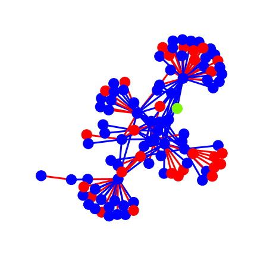

# RL Routing
[](http://colab.research.google.com/github/LukeWood/rl-routing/blob/master/notebooks/shortest-path-agent.ipynb)

<p align="center">
<kbd>
 
 </kbd>
</p>

RL-routing provides a reinforcement learning environment for routing problems.
The environment relies on an underlying [networkx](https://networkx.org) graph.
This is passed to the environment during construction as `graph`.  
It is recommended to set `pos` for the nodes to ensure consistent rendering.
`spring_layout` provides a simple api to do this.

e.x.
```
G=nx.random_internet_as_graph(100)
pos = nx.spring_layout(G)
nx.set_node_attributes(G, pos, "pos")
nx.draw(G)
env = NetworkEnv(graph=G)
```

The environment follows a simple set of rules:
- reward is the number of packets to reach their destination during a setp
- edges are treated as wires
- one packet may occupy a wire per step

The environment renders to an rgb array.
This allows it to be rendered to a matplotlib.pyplot plot, an output gif, or any other format desired.
The visualization uses `red` to indicate that a node or edge is occupied by a packet, `blue` to show that an edge or node is vacant, or `green` to show that a packet was successfully routed.

## Quickstart
The easiest way to get started using rl-routing is to open up the 
[Shortest Path Base Case in Colab](http://colab.research.google.com/github/LukeWood/rl-routing/blob/master/notebooks/shortest-path-agent.ipynb).  This base case runs you through processing observations, setting up the environment, and creating a shortest path agent.

## Citation
Please cite any usage of this repo in research.

bibtex entry:
```bibtex
@misc{lukewood_2020, 
  title={RL Routing},
  url={https://github.com/lukewood/rl-routing},
  publisher={Github},
  author={LukeWood},
  year={2020},
  month={Oct}
} 
```
